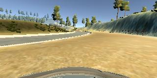

# Behavioral Cloning

## Behavioral Cloning Project

The goals / steps of this project are the following:
* Use the simulator to collect data of good driving behavior
* Build, a convolution neural network in Keras that predicts steering angles from images
* Train and validate the model with a training and validation set
* Test that the model successfully drives around track one without leaving the road
* Summarize the results with a written report


## Rubric Points
### Here I will consider the [rubric points](https://review.udacity.com/#!/rubrics/432/view) individually and describe how I addressed each point in my implementation.  

### Files Submitted & Code Quality

#### 1. Submission includes all required files and can be used to run the simulator in autonomous mode

My project includes the following files:
* model.py containing the script to create and train the model
* drive.py for driving the car in autonomous mode
* model.h5 containing a trained convolution neural network 
* writeup.md summarizing the results

#### 2. Submission includes functional code

Using the Udacity provided simulator and my drive.py file, the car can be driven
autonomously around the track by executing

```sh
python drive.py model.h5
```

#### 3. Submission code is usable and readable

The `model.py` file contains the code for training and saving the convolution
neural network. The file shows the pipeline I used for training and validating
the model, and it contains comments to explain how the code works.

### Model Architecture and Training Strategy

#### 1. An appropriate model architecture has been employed

| Layer         		|     Description	        					| 
|:---------------------:|:---------------------------------------------:| 
| Input         		| 160x320x3 RBG image    						| 
| Cropping2D            | 65x320x3 RBG image                            | 
| Convolution 5x5     	| 2x2 stride, same padding, outputs 31x158x24   |
| RELU					|												|
| Convolution 5x5	    | 2x2 stride, same padding, outputs 14x77x36	|
| RELU					|												|
| Convolution 5x5	    | 2x2 stride, same padding, outputs 5x37x48 	|
| RELU					|												|
| Convolution 3x3	    | 1x1 stride, same padding, outputs 3x35x64 	|
| RELU					|												|
| Convolution 3x3	    | 1x1 stride, same padding, outputs 1x33x64 	|
| RELU					|												|
| Fully connected		| input 2112, output 100						|
| Fully connected		| input 100, output 50							|
| Fully connected		| input 50, output 10							|
| Fully connected		| input 10, output 1							|


#### 2. Attempts to reduce overfitting in the model

The model was trained and validated on different data sets to ensure that the
model was not overfitting (code line 79, 80, 122-126). The model was tested by
running it through the simulator and ensuring that the vehicle could stay on the
track.

#### 3. Model parameter tuning

The model used an adam optimizer, so the learning rate was not tuned manually
(model.py line 121).

#### 4. Appropriate training data

Training data was chosen to keep the vehicle driving on the road. I used a
combination of center lane driving, recovering from the left and right sides of
the road, driving in clockwise direction.

For details about how I created the training data, see the next section. 

### Model Architecture and Training Strategy

#### 1. Solution Design Approach

The overall strategy for deriving a model architecture was to keep the car on
the center of the lane.

My first step was to use a convolution neural network model similar to the
LeNet. I thought this model might be appropriate because it works well on
traffic sign classification. It didn't work well so I switched to Nvidia
architecture mentioned from the lecture. At the beginning, the car fell off the
track on sharpe turns and I relized that when I trained the model (driving the
car manually), I almost did the same thing. So I deleted all the training data
and recollected the data more carefully. Using the same model but different
training data, the car is able to drive autonomously around the track without
leaving the road.


#### 2. Creation of the Training Set & Training Process

To capture good driving behavior, I first recorded two laps on track one using
center lane driving. Here is an example image of center lane driving:


I then recorded the vehicle recovering from the left side and right sides of the
road back to center so that the vehicle would learn to drive back to the road.
These images show what a recovery looks like starting from ... :




To augment the data set, I also flipped images and angles thinking that this
would make the data more general. For example, here is an image that has then
been flipped:


After the collection process, I had 8312 number of data points. I
then preprocessed this data by:

- normalization
- cropping
- flipping
- left/right camera correction

So the final size of data points is 8312 * 6 = 49872.


I finally randomly shuffled the data set and put Y% of the data into a
validation set.

I used this training data for training the model. The validation set helped
determine if the model was over or under fitting. The ideal number of epochs was
10 as evidenced by `val_loss`. I used an `adam ` optimizer so that manually
training the learning rate wasn't necessary.
